# Courier-GUI
Courier GUI application is a parcel management system. The application is written in JavaFX + JDBC (MySQL).

When you launch the application, you have the choice to log in as an admin or as a courier.
It is also possible to register a new courier.
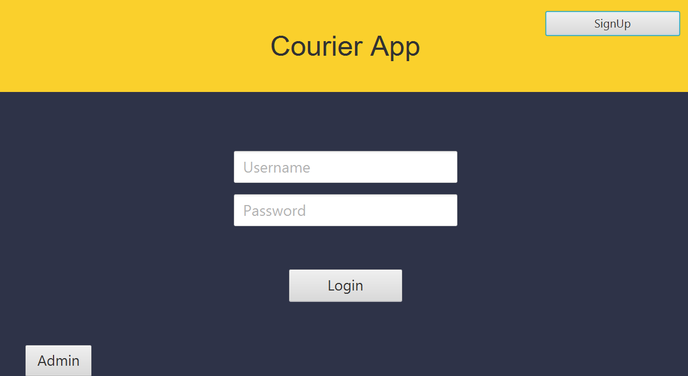
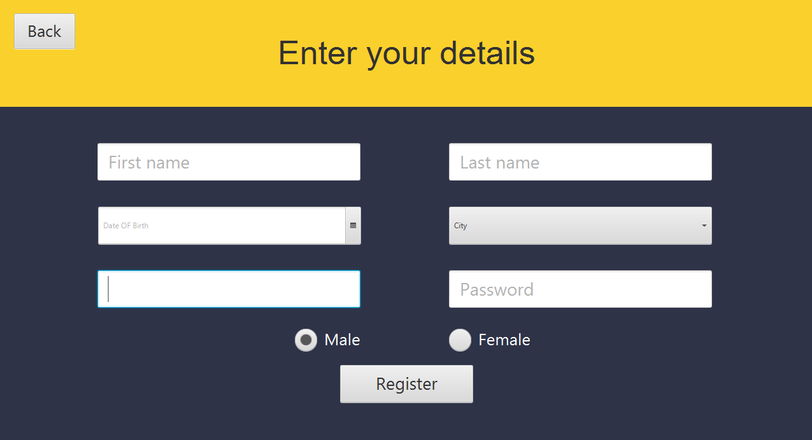

When we are logged in as an admin, we can select a country or add a new one.
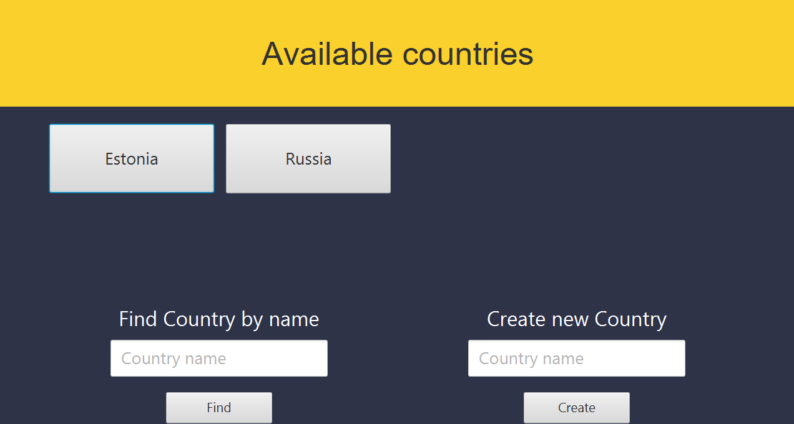

After selecting a country, we see a menu in which we can select / create a city, select a courier, and also view a map.
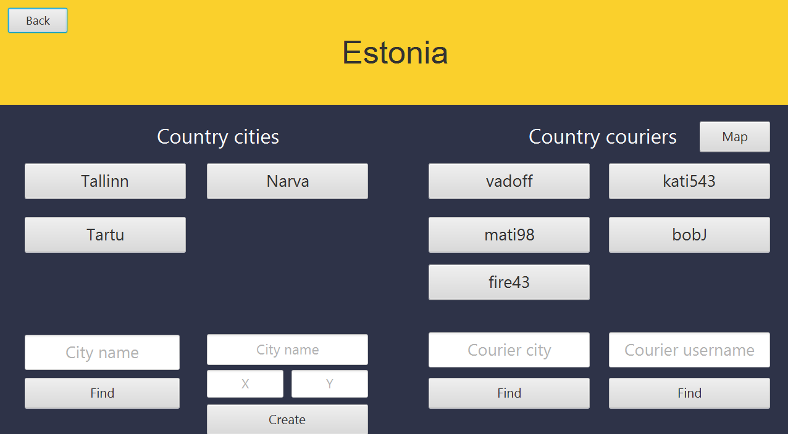

On the map we see the current location of couriers and cities that are located in this country.
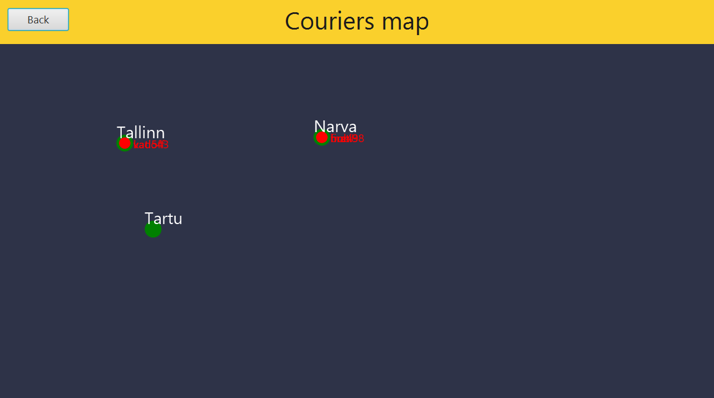

By selecting a city, we can see all the parcels that need to be sent and all the parcels that have already been delivered to this city.
To send a parcel, we need to choose a free courier who is currently located in this city.
We can also add a parcel indicating to which city we need to deliver it and its weight.
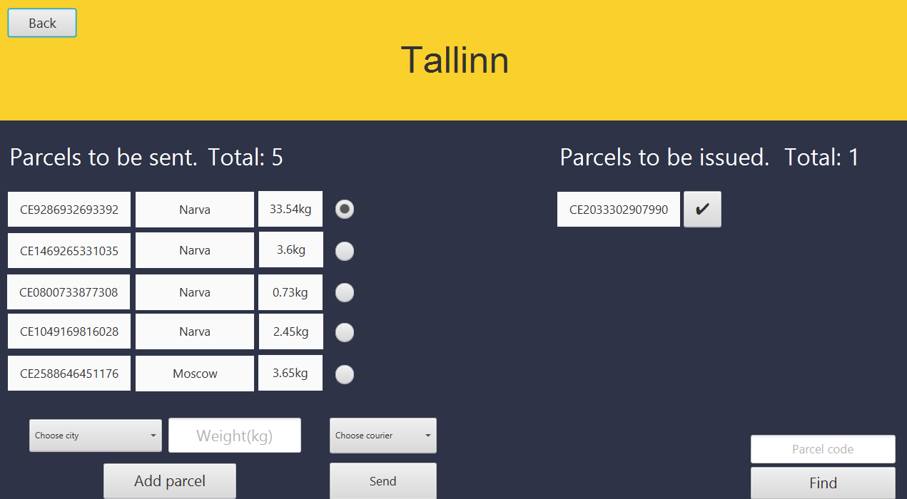

Let's go back and choose a courier. We see his data, current location, and the number of parcels.
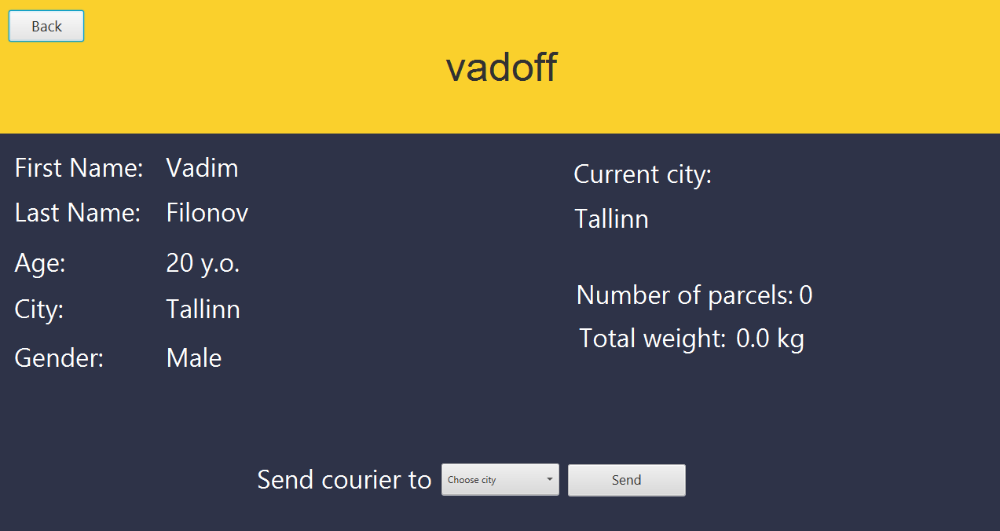

When we load the courier, we must choose a destination. After that, the courier will be able to go.
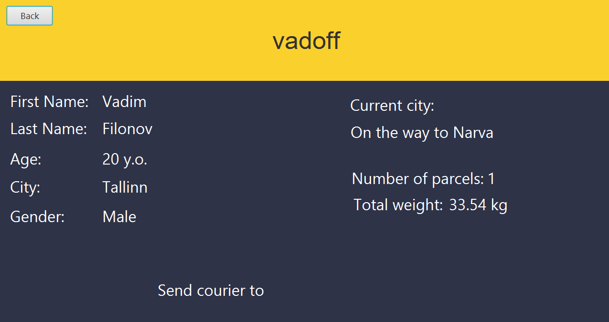

Now let's move on to the courier menu. 
It has a simple window where pressing the Drive button simulates its ride and the Unload button unloads all the packages at the destination.
The courier will not be able to go until he is assigned a destination.
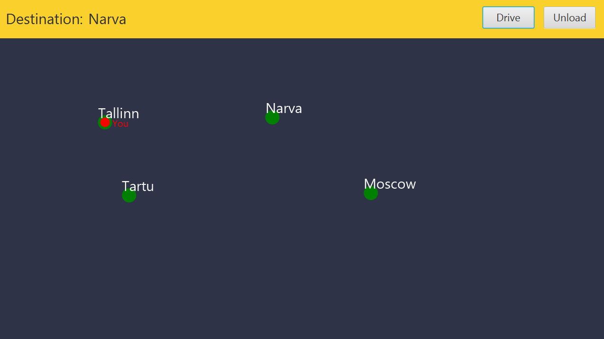
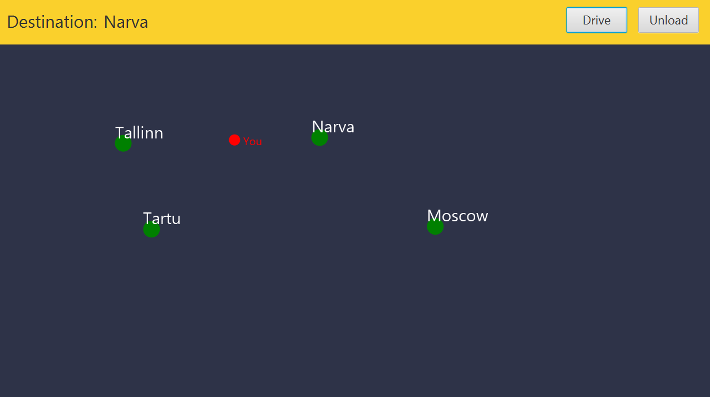
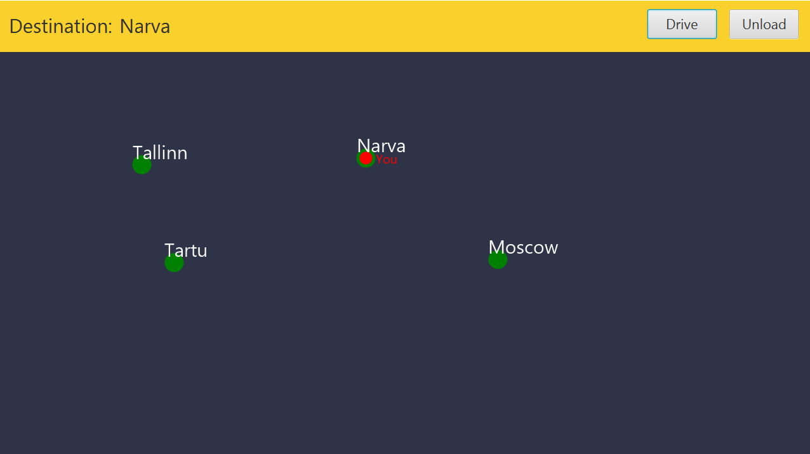
